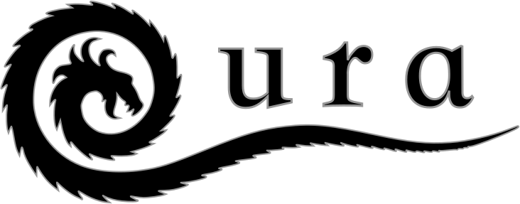
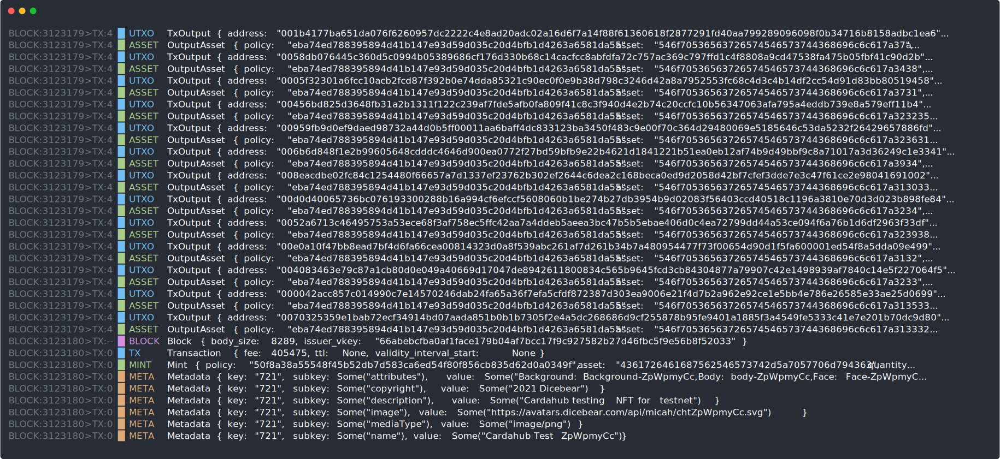
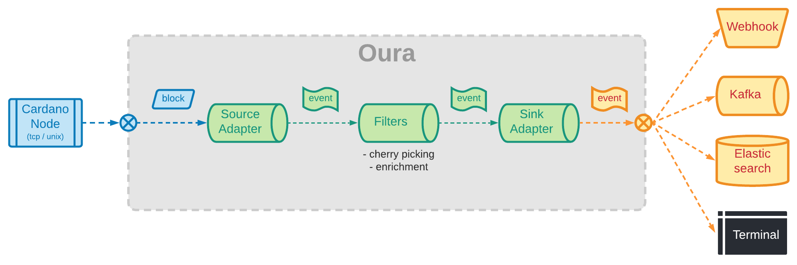

    
    

        <h2 align="center" style="border-bottom: none">The tail of Cardano</h2>
        
        
        
    

## Introduction

We have tools to "explore" the Cardano blockchain, which are useful when you know what you're looking for. We argue that there's a different, complementary use-case which is to "observe" the blockchain and react to particular event patterns.

_Oura_ is a rust-native implementation of a pipeline that connects to the tip of a Cardano node through a combination of _Ouroboros_ mini-protocol (using either a unix socket or tcp bearer), filters the events that match a particular pattern and then submits a succint, self-contained payload to pluggable observers called "sinks".

Check our [documentation](https://txpipe.github.io/oura) for detailed information on how to start working with _Oura_.

## Etymology

The name of the tool is inspired by the `tail` command available in unix-like systems which is used to display the tail end of a text file or piped data. Cardano's consensus procotol name, _Ouroboros_, is a reference to the ancient symbol depicting a serpent or dragon eating its own tail, which means "tail eating". "Oura" is the ancient greek word for "tail".

## Terminal Output Demo

In this terminal recording we get to see a few mins of live output from a testnet node connected to the terminal sink.

[watch full asciicast](https://asciinema.org/a/453455)

## Under the Hood

All the heavy lifting required to communicate with the Cardano node is done by the [Pallas](https://github.com/txpipe/pallas) library, which provides an implementation of the Ouroboros multiplexer and a few of the required mini-protocol state-machines (ChainSync and LocalState in particular).

The data pipeline makes heavy use (maybe a bit too much) of multi-threading and mpsc channels provided by Rust's `std::sync` library.

## Use Cases

### CLI to Watch Live Transactions

You can run `oura watch <socket>` to print TX data into the terminal from the tip of a local or remote node. It can be useful as a debugging tool for developers or if you're just curious to see whats going on in the network (for example, to see airdrops as they happen or oracles posting new information).

### As a Bridge to Other Persistence Mechanisms

Similar to the well-known db-sync tool provided by IOHK, _Oura_ can be used as a daemon to follow a node and output the data into a different data storage techonology more suited for your final use-case. The main difference with db-sync is that _Oura_ was designed for easy integration with data-streaming pipelines instead of relational databases.

Given its small memory / cpu footprint, _Oura_ can be deployed side-by-side with your Cardano node even in resource-constrained environments, such as Raspberry PIs.

### As a Trigger of Custom Actions

_Oura_ running in `daemon` mode can be configured to use custom filters to pinpoint particular transaction patterns and trigger actions whenever it finds a match. For example: send an email when a particular policy / asset combination appears in a transaction; call an AWS Lambda function when a wallet delegates to a particular pool; send a http-call to a webhook each time a metadata key appears in the TX payload;

### As a Library for Custom Scenarios

If the available out-of-the-box features don't satisfiy your particular use-case, _Oura_ can be used a library in your Rust project to setup tailor-made pipelines. Each component (sources, filters, sinks, etc) in _Oura_ aims at being self-contained and reusable. For example, custom filters and sinks can be built while reusing the existing sources.

## How it Works

Oura is in its essence just a pipeline for proccessing events. Each stage of the pipeline fulfills a different roles:

- Source Stages: are in charge of pulling data from the blockchain and mapping the raw blocks into smaller, more granular events. Each event is then sent through the output port of the stage for further processing.
- Filter Stages: receive individual events from the source stage and apply some sort of transformation to each one. The transformations applied will depend on the particular use-case, but they usually revolve around selecting relevant events and enriching them with extra information.
- Sink Stages: receive the final events from the filter stage and submits the payload to some external system, database or service for further processing.

## Feature Status

- Sources
  - [x] chain-sync full-block (node-to-client)
  - [x] chain-sync + block-fetch (node-to-node)
  - [x] Parsing of Shelley-compatible blocks (Shelley, Allegra, Mary, Alonzo)
  - [x] Parsing of Byron blocks
- Sinks
  - [x] Kafka topic
  - [x] Elasticsearch index / data stream
  - [x] Rotating log files with compression
  - [x] Redis streams
  - [x] AWS SQS queue
  - [x] AWS Lambda call
  - [x] AWS S3 objects
  - [ ] GCP Sinks
  - [ ] Azure Sinks
  - [x] webhook (http post)
  - [x] terminal (append-only, tail-like)
- Events / Parsers
  - [x] block events (start, end)
  - [x] transaction events (inputs, outputs, assets)
  - [x] metadata events (labels, content)
  - [x] mint events (policy, asset, quantity)
  - [x] pool registrations events
  - [x] delegation events
  - [x] CIP-25 metadata parser (image, files)
  - [ ] CIP-15 metadata parser
- Filters
  - [x] cherry pick by event type (block, tx, mint, cert, etc)
  - [x] cherry pick by asset subject (policy, name, etc)
  - [x] cherry pick by metadata keys
  - [ ] cherry pick by block property (size, tx count)
  - [ ] cherry pick by tx property (fee, has native script, has plutus script, etc)
  - [ ] cherry pick by utxo property (address, asset, amount range)
  - [ ] enrich events with policy info from external metadata service
  - [ ] enrich input tx info from Blockfrost API
  - [ ] enrich addresses descriptions using ADAHandle
- Other
  - [x] stateful chain cursor to recover from restarts
  - [x] buffer stage to hold blocks until they reach a certain depth
  - [x] pipeline metrics to track the progress and performance

## Known Limitations

- ~~Oura only knows how to process blocks from the Shelley era. We are working on adding support for Byron in a future release.~~ (available since v1.2)
- Oura reads events from minted blocks / transactions. Support for querying the mempool is planned for a future release.
- ~~Oura will notify about chain rollbacks as a new event. The business logic for "undoing" the already processed events is a responsability of the consumer. We're working on adding support for a "buffer" filter stage which can hold blocks until they reach a configurable depth (number of confirmations).~~ (rollback buffer available since v1.2)

## Contributing

All contributions are welcome, but please read the [contributing guide](.github/CONTRIBUTING.md#scope) of the project before starting to code.

## License

This project is licensed under the Apache-2.0 license. Please see the [LICENSE](LICENSE.md) file for more details.