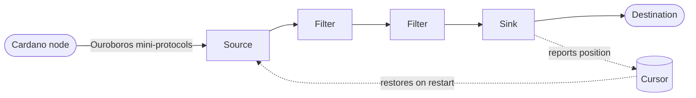

_Oura_ is a streaming pipeline. It connects to a Cardano node, reads the chain one block at a
time, runs each event through a chain of filters, and hands the result to a sink. Every stage
is independent and runs on its own thread, so data flows through continuously rather than in
batches.



## The pipeline

A pipeline is just four pieces, wired together in your `daemon.toml`:

- **[Source](/oura/v2/sources)** — connects to the chain and produces a stream of events. It can
  read from a local node (`N2C`), a remote relay (`N2N`), a [UTxO RPC](/oura/v2/sources/utxorpc)
  endpoint, and [more](/oura/v2/sources).
- **[Intersect](/oura/v2/advanced/intersect_options)** — tells the source *where on the chain to
  start*. The default is the current tip; you can also start from the origin or a specific point
  to backfill history.
- **[Filters](/oura/v2/filters)** — a sequence of transformations applied to each event, in
  order. Filters decode the raw block, split it into transactions, keep only what matches a
  pattern, reshape it into JSON, and so on.
- **[Sink](/oura/v2/sinks)** — the destination. It takes the final event and sends it somewhere:
  your terminal, a file, a message broker, a database, an HTTP endpoint, a cloud service.

## Events and rollbacks

The Cardano chain isn't append-only — the tip can **reorganize**, abandoning recently-seen
blocks in favor of a competing fork. Oura surfaces this directly: every event carries an
**action** describing what happened to the block.

- `apply` — a block was added to the chain. The normal case.
- `undo` — a block was rolled back. If your sink already acted on it, you need to reverse that.
- `reset` — the pipeline jumped to a new position (for example, on startup or after recovering
  across a gap). It carries a `point`, not a record.

This is the one concept worth getting right before you build a consumer, because **how you
handle `undo` is up to you**. There are three common approaches:

- **Handle it** — react to `undo` events and reverse whatever the matching `apply` did. Most
  precise, but your downstream logic has to support it.
- **Buffer it away** — add the [RollbackBuffer filter](/oura/v2/filters/rollback_buffer) to hold
  blocks until they're deep enough to be unlikely to roll back, so your sink rarely sees an
  `undo` at all (it trades a little latency for simplicity).
- **Stay idempotent** — design the sink so reprocessing the same block is harmless, and combine
  it with a [cursor](/oura/v2/advanced/stateful_cursor) so a restart resumes cleanly instead of
  re-reading from scratch.

For the exact JSON shape of an event — the `event` / `point` / `record` envelope — see the
[Data Dictionary](/oura/v2/reference/data_dictionary).

## How records change shape

The `record` inside each event isn't fixed — its shape depends on which filters ran before the
sink. A source emits the raw block as CBOR; filters progressively refine it:

```
CborBlock ──SplitBlock──▶ CborTx ──ParseCbor──▶ parsed Tx ──IntoJson──▶ JSON
```

So a sink reading straight from a source sees raw block CBOR, while one sitting after
`ParseCbor` sees a structured transaction. You compose the chain to produce whatever shape your
destination needs. The canonical pipeline — `SplitBlock → ParseCbor → Select → sink` — is a good
default starting point.

See the [Filters overview](/oura/v2/filters) for the full set, and the record-variant table in
the [Data Dictionary](/oura/v2/reference/data_dictionary) for exactly which filter produces which
shape.
