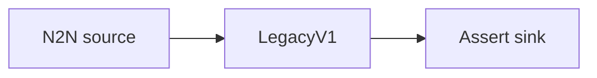

# Assert sink

Run the chain through the `Assert` sink, which validates the event stream against internal
invariants. Intended for testing and pipeline validation rather than production output.

## Pipeline



- **Source** — `N2N`: mainnet relay, starting from the chain tip.
- **Filters** — `LegacyV1`: maps records to the legacy v1 event model.
- **Sink** — `Assert`: checks invariants over the event stream and reports violations.

## Run

```sh
cd examples/assert
oura daemon --config daemon.toml
```
