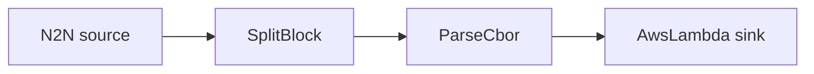

# AWS Lambda sink

Decode transactions and invoke an AWS Lambda function once per event.

## Pipeline



- **Source** — `N2N`: mainnet relay, starting from the chain tip.
- **Filters**
  - `SplitBlock`: breaks each block into individual transactions.
  - `ParseCbor`: decodes the raw transaction CBOR into structured records.
- **Sink** — `AwsLambda`: invokes `function_name` in `region` with each event as the payload.

## Prerequisites

- Built with the `aws` feature.
- AWS credentials available to the process (env vars, profile, or instance role) with
  permission to invoke the function.
- Edit `region` and `function_name` in `daemon.toml` to match your function.

## Run

```sh
cd examples/aws_lambda
cargo run --features aws --bin oura -- daemon --config daemon.toml
```

(or `oura daemon --config daemon.toml` with a binary built with the `aws` feature.)
