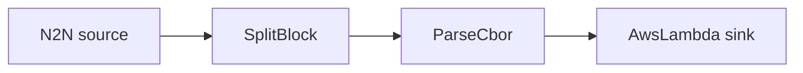

# AWS Lambda sink

Decode transactions and invoke an AWS Lambda function once per event.

## Pipeline



- **Source** — `N2N`: mainnet relay, starting from the chain tip.
- **Filters**
  - `SplitBlock`: breaks each block into individual transactions.
  - `ParseCbor`: decodes the raw transaction CBOR into structured records.
- **Sink** — `AwsLambda`: invokes `function_name` in `region` with each event as the
  JSON payload.

## Prerequisites

- Built with the `aws` feature.
- A running Docker engine — LocalStack runs each Lambda invocation in its own container
  (the compose file mounts the Docker socket for this).

## Run standalone (LocalStack)

The included `docker-compose.yml` starts [LocalStack](https://www.localstack.cloud/) and
deploys `my-lambda` (a tiny function in `localstack/handler.py` that logs each event), so
the example runs without a real AWS account:

```sh
cd examples/aws_lambda
docker compose up -d
```

Point the AWS SDK at LocalStack with dummy credentials, then run Oura:

```sh
export AWS_ENDPOINT_URL=http://localhost.localstack.cloud:4566
export AWS_ACCESS_KEY_ID=test AWS_SECRET_ACCESS_KEY=test AWS_REGION=us-east-1
cargo run --features aws --bin oura -- daemon --config daemon.toml
```

(or `oura daemon --config daemon.toml` with a binary built with the `aws` feature.)

Watch the function get invoked — one `lambda.Invoke => 200` per event:

```sh
docker compose logs -f localstack | grep "lambda.Invoke"
```

## Run against real AWS

Skip the compose step and the `AWS_ENDPOINT_URL` export. Provide real credentials (env
vars, profile, or instance role) with permission to invoke the function, and set `region`
and `function_name` in `daemon.toml` to match it.
