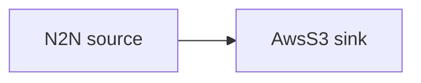

# AWS S3 sink

Write each block's raw CBOR as an object into an S3 bucket.

## Pipeline



- **Source** — `N2N`: mainnet relay, starting from the chain tip.
- **Sink** — `AwsS3`: writes one object per block under `prefix` in `bucket` (`region`),
  keyed by `slot.hash`. The `AwsS3` sink stores the block CBOR as-is, so the example runs
  no filters — a `ParseCbor` / `SplitBlock` filter would change the record type and the
  sink would reject it.

## Prerequisites

- Built with the `aws` feature.

## Run standalone (LocalStack)

The included `docker-compose.yml` starts [LocalStack](https://www.localstack.cloud/) and
provisions the `my-bucket` bucket, so the example runs without a real AWS account:

```sh
cd examples/aws_s3
docker compose up -d
```

Point the AWS SDK at LocalStack with dummy credentials, then run Oura:

```sh
export AWS_ENDPOINT_URL=http://s3.localhost.localstack.cloud:4566
export AWS_ACCESS_KEY_ID=test AWS_SECRET_ACCESS_KEY=test AWS_REGION=us-east-1
cargo run --features aws --bin oura -- daemon --config daemon.toml
```

(or `oura daemon --config daemon.toml` with a binary built with the `aws` feature.)

Inspect the objects Oura wrote:

```sh
docker exec localstack-s3 awslocal s3 ls s3://my-bucket/mainnet/
```

## Run against real AWS

Skip the compose step and the `AWS_ENDPOINT_URL` export. Provide real credentials (env
vars, profile, or instance role) with permission to write to the bucket, and edit
`region`, `bucket`, and `prefix` in `daemon.toml` to match it.
