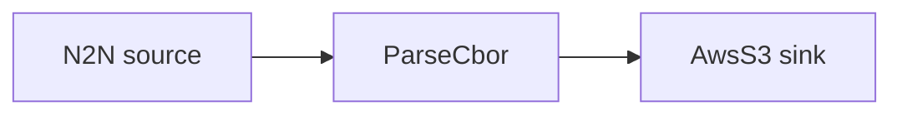

# AWS S3 sink

Decode transactions and write each one as an object into an S3 bucket.

## Pipeline



- **Source** — `N2N`: mainnet relay, starting from the chain tip.
- **Filters** — `ParseCbor`: decodes the raw transaction CBOR into structured records.
- **Sink** — `AwsS3`: writes objects under `prefix` in `bucket` (`region`).

## Prerequisites

- Built with the `aws` feature.
- AWS credentials available to the process (env vars, profile, or instance role) with
  permission to write to the bucket.
- Edit `region`, `bucket`, and `prefix` in `daemon.toml` to match your bucket.

## Run

```sh
cd examples/aws_s3
cargo run --features aws --bin oura -- daemon --config daemon.toml
```

(or `oura daemon --config daemon.toml` with a binary built with the `aws` feature.)
