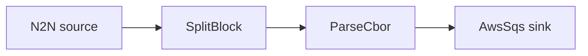

# AWS SQS sink

Decode transactions and enqueue each one as a message on an Amazon SQS queue.

## Pipeline



- **Source** — `N2N`: mainnet relay, starting from the chain tip.
- **Filters**
  - `SplitBlock`: breaks each block into individual transactions.
  - `ParseCbor`: decodes the raw transaction CBOR into structured records.
- **Sink** — `AwsSqs`: sends messages to `queue_url` (`region`) with the configured
  `group_id` (FIFO queues).

## Prerequisites

- Built with the `aws` feature.
- AWS credentials available to the process (env vars, profile, or instance role) with
  permission to send to the queue.
- Edit `region`, `queue_url`, and `group_id` in `daemon.toml` to match your queue.

## Run

```sh
cd examples/aws_sqs
cargo run --features aws --bin oura -- daemon --config daemon.toml
```

(or `oura daemon --config daemon.toml` with a binary built with the `aws` feature.)
