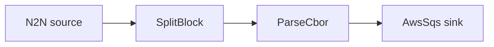

# AWS SQS sink

Decode transactions and enqueue each one as a message on an Amazon SQS queue.

## Pipeline



- **Source** — `N2N`: mainnet relay, starting from the chain tip.
- **Filters**
  - `SplitBlock`: breaks each block into individual transactions.
  - `ParseCbor`: decodes the raw transaction CBOR into structured records.
- **Sink** — `AwsSqs`: sends each event as a JSON message to `queue_url` (`region`). For a
  FIFO queue (`queue_url` ending in `.fifo`) the configured `group_id` is used.

## Prerequisites

- Built with the `aws` feature.

## Run standalone (LocalStack)

The included `docker-compose.yml` starts [LocalStack](https://www.localstack.cloud/) and
provisions the `my-queue` queue that `daemon.toml` points at, so the example runs without a
real AWS account:

```sh
cd examples/aws_sqs
docker compose up -d
```

Point the AWS SDK at LocalStack with dummy credentials, then run Oura:

```sh
export AWS_ENDPOINT_URL=http://localhost.localstack.cloud:4566
export AWS_ACCESS_KEY_ID=test AWS_SECRET_ACCESS_KEY=test AWS_REGION=us-east-1
cargo run --features aws --bin oura -- daemon --config daemon.toml
```

(or `oura daemon --config daemon.toml` with a binary built with the `aws` feature.)

Read the messages Oura enqueued:

```sh
docker exec localstack-sqs awslocal sqs receive-message \
  --queue-url http://localhost:4566/000000000000/my-queue
```

## Run against real AWS

Skip the compose step and the `AWS_ENDPOINT_URL` export. Provide real credentials (env
vars, profile, or instance role) with permission to send to the queue, and set `region`,
`queue_url`, and `group_id` in `daemon.toml` to match your queue.
