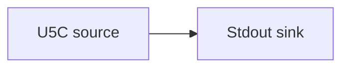

# UTxO RPC (U5C) source

Read the chain from a [UTxO RPC](https://utxorpc.org) (U5C) endpoint — such as a local
[Dolos](https://github.com/txpipe/dolos) node or a hosted [Demeter](https://demeter.run)
endpoint — and print events to standard output.

## Pipeline



- **Source** — `U5C`: connects to the gRPC `url`, starting from the chain tip. The
  `metadata` table carries extra gRPC headers; leave it empty (`{}`) for a local
  unauthenticated Dolos, or pass an API key for a hosted endpoint
  (`metadata = { "dmtr-api-key" = "dmtr_..." }`).
- **Sink** — `Stdout`: prints each event.

## Prerequisites

- A running U5C endpoint (a local Dolos on `localhost:50051`, or a hosted U5C URL).
- Built with the `u5c` feature (it ships in the released binaries by default).

## Run

```sh
cd examples/dolos_source
oura daemon --config daemon.toml
```

From source:

```sh
cargo run --features u5c --bin oura -- daemon --config daemon.toml
```
