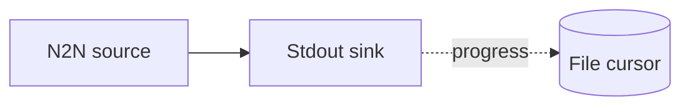

# File cursor

Persist pipeline progress to a local file so that, on restart, Oura resumes from the last
processed point instead of the configured intersect.

## Pipeline



- **Source** — `N2N`: mainnet relay, starting from the `Point` in `[intersect]` (used only
  on the first run, before a cursor exists).
- **Cursor** — `File`: writes the latest position to `my_cursor.json` in the working
  directory; subsequent runs resume from it.
- **Sink** — `Stdout`: prints each event.

## Run

```sh
cd examples/file_cursor
oura daemon --config daemon.toml
```

Stop and restart the daemon to see it resume from `my_cursor.json` rather than the intersect
point.
