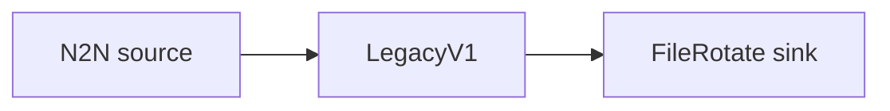

# File Rotate sink

Write legacy v1 events to rotated, compressed JSONL files on disk.

## Pipeline



- **Source** — `N2N`: mainnet relay, starting from the `Point` in `[intersect]`.
- **Filters** — `LegacyV1`: maps records to the legacy v1 event model
  (`include_transaction_details = true`).
- **Sink** — `FileRotate`: writes JSONL to `./output/logs.jsonl`, rotating across up to 5
  compressed files of 5 MB each.

See the [FileRotate sink docs](../../docs/v2/sinks/file_rotate.mdx).

## Run

```sh
cd examples/file_rotate
oura daemon --config daemon.toml
```

Output is written to `./output/` in the working directory.
