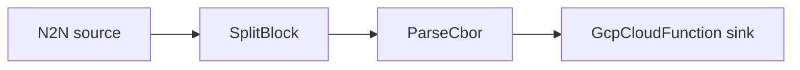

# GCP Cloud Function sink

Decode transactions and call a Google Cloud Function once per event.

## Pipeline



- **Source** — `N2N`: mainnet relay, starting from the chain tip.
- **Filters**
  - `SplitBlock`: breaks each block into individual transactions.
  - `ParseCbor`: decodes the raw transaction CBOR into structured records.
- **Sink** — `GcpCloudFunction`: invokes the function at `url`
  (`authentication = true` attaches a Google-issued identity token).

## Prerequisites

- Built with the `gcp` feature.
- GCP credentials available to the process (e.g. `GOOGLE_APPLICATION_CREDENTIALS`) with
  permission to invoke the function.
- Edit `url` in `daemon.toml` to point at your deployed function.

## Run

```sh
cd examples/gcp_cloudfunction
cargo run --features gcp --bin oura -- daemon --config daemon.toml
```

(or `oura daemon --config daemon.toml` with a binary built with the `gcp` feature.)
