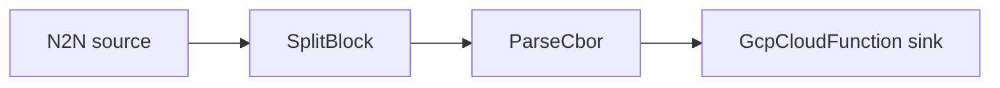

# GCP Cloud Function sink

Decode transactions and call a Google Cloud Function (or any HTTP endpoint) once per event.

## Pipeline



- **Source** — `N2N`: mainnet relay, starting from the chain tip.
- **Filters**
  - `SplitBlock`: breaks each block into individual transactions.
  - `ParseCbor`: decodes the raw transaction CBOR into structured records.
- **Sink** — `GcpCloudFunction`: POSTs each event as JSON to `url`. With
  `authentication = true` it attaches a Google-issued identity token (requires real GCP
  credentials); with `authentication = false` it is a plain HTTP POST.

## Prerequisites

- Built with the `gcp` feature.

## Run standalone (local endpoint)

A Cloud Function is just an HTTP endpoint, so the included `docker-compose.yml` starts an
echo server on `:8080` that logs every request. `daemon.toml` posts to it with
`authentication = false`, so the example runs without a GCP project:

```sh
cd examples/gcp_cloudfunction
docker compose up -d
cargo run --features gcp --bin oura -- daemon --config daemon.toml
```

(or `oura daemon --config daemon.toml` with a binary built with the `gcp` feature.)

Watch the events arrive at the endpoint:

```sh
docker compose logs -f function
```

## Run against a real Cloud Function

Set `url` in `daemon.toml` to the function's trigger URL and `authentication = true`, then
provide credentials via `GOOGLE_APPLICATION_CREDENTIALS` with permission to invoke it. The
identity-token path can't be exercised against the local echo server.
