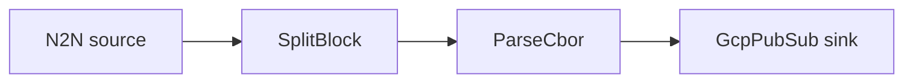

# GCP Pub/Sub sink

Decode transactions and publish each one to a Google Cloud Pub/Sub topic.

## Pipeline



- **Source** — `N2N`: mainnet relay, starting from the chain tip.
- **Filters**
  - `SplitBlock`: breaks each block into individual transactions.
  - `ParseCbor`: decodes the raw transaction CBOR into structured records.
- **Sink** — `GcpPubSub`: publishes events to `topic`.

## Prerequisites

- Built with the `gcp` feature.
- GCP credentials available to the process (e.g. `GOOGLE_APPLICATION_CREDENTIALS`) with
  permission to publish to the topic.
- Edit `topic` in `daemon.toml` to match your topic.

## Run

```sh
cd examples/gcp_pubsub
cargo run --features gcp --bin oura -- daemon --config daemon.toml
```

(or `oura daemon --config daemon.toml` with a binary built with the `gcp` feature.)
