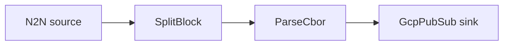

# GCP Pub/Sub sink

Decode transactions and publish each one to a Google Cloud Pub/Sub topic.

## Pipeline



- **Source** — `N2N`: mainnet relay, starting from the chain tip.
- **Filters**
  - `SplitBlock`: breaks each block into individual transactions.
  - `ParseCbor`: decodes the raw transaction CBOR into structured records.
- **Sink** — `GcpPubSub`: publishes each event as a message to `topic`.

## Prerequisites

- Built with the `gcp` feature.

## Run standalone (Pub/Sub emulator)

The included `docker-compose.yml` starts Google's Pub/Sub emulator and provisions the
`my-topic` topic (plus a `my-sub` subscription so you can read messages back), so the
example runs without a real GCP project:

```sh
cd examples/gcp_pubsub
docker compose up -d
```

Point the client at the emulator, then run Oura:

```sh
export PUBSUB_EMULATOR_HOST=localhost:8085
cargo run --features gcp --bin oura -- daemon --config daemon.toml
```

(or `oura daemon --config daemon.toml` with a binary built with the `gcp` feature.)

> In emulator mode the Pub/Sub client always uses the project id `local-project`, so the
> compose file provisions the topic under that project.

Pull the messages Oura published:

```sh
curl -s -X POST \
  http://localhost:8085/v1/projects/local-project/subscriptions/my-sub:pull \
  -H 'Content-Type: application/json' -d '{"maxMessages":5}'
```

## Run against real GCP

Skip the compose step and the `PUBSUB_EMULATOR_HOST` export. Provide credentials via
`GOOGLE_APPLICATION_CREDENTIALS` with permission to publish, and set `topic` in
`daemon.toml` to match your topic.
