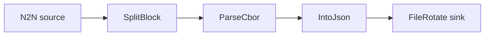

# Into JSON to JSONL files

Decode transactions and convert the parsed records into JSON before writing them to rotated,
compressed JSONL files. Builds on the `parse_cbor` example by adding the `IntoJson` filter.

## Pipeline



- **Source** — `N2N`: mainnet relay, starting from the `Point` in `[intersect]`.
- **Filters**
  - `SplitBlock`: breaks each block into individual transactions.
  - `ParseCbor`: decodes the raw transaction CBOR into structured records.
  - `IntoJson`: turns the parsed records into JSON payloads.
- **Sink** — `FileRotate`: writes JSONL to `./output/logs.jsonl`, rotating across up to 5
  compressed files of 5 MB each.

## Run

```sh
cd examples/into_json
oura daemon --config daemon.toml
```

Output is written to `./output/` in the working directory.
