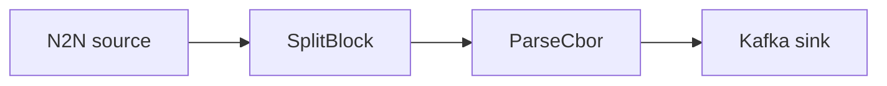

# Kafka sink

Decode transactions and publish them to an Apache Kafka topic, partitioned by block.

## Pipeline



- **Source** — `N2N`: mainnet relay, starting from the chain tip.
- **Filters**
  - `SplitBlock`: breaks each block into individual transactions.
  - `ParseCbor`: decodes the raw transaction CBOR into structured records.
- **Sink** — `Kafka`: publishes to `topic` on the configured `brokers`, using `ByBlock`
  partitioning.

## Prerequisites

- Built with the `kafka` feature.
- A running Kafka broker — a `docker-compose.yaml` is included.

```sh
docker compose up -d
```

## Run

```sh
cd examples/kafka
cargo run --features kafka --bin oura -- daemon --config daemon.toml
```

(or `oura daemon --config daemon.toml` with a binary built with the `kafka` feature.)
