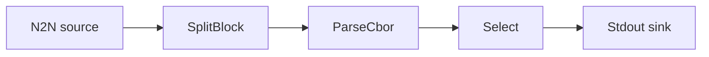

# Metadata regex filter

Keep only the transactions whose metadata matches a regular expression, and print them to
standard output. Runs against preprod.

## Pipeline



- **Source** — `N2N`: preprod relay, starting from the chain tip.
- **Filters**
  - `SplitBlock`: breaks each block into individual transactions.
  - `ParseCbor`: decodes the raw transaction CBOR into structured records.
  - `Select`: keeps records whose metadata at `label = 674` has text matching the `regex`
    predicate. The search recurses through nested arrays and maps; omit `label` to search
    across all metadata.
- **Sink** — `Stdout`: prints the matching transactions.

## Configuration

```toml
[[filters]]
type = "Select"
skip_uncertain = false

[filters.predicate.match.metadata]
label = 674

[filters.predicate.match.metadata.value.text]
regex = "Hello World"
```

Common regex patterns:

```toml
regex = "(?i)keyword"      # case-insensitive
regex = "^MyApp:"           # starts with
regex = "payment|donation"  # multiple keywords
```

## Run

```sh
cd examples/metadata_regex_filter
oura daemon --config daemon.toml
```

## See also

- [Select filter docs](../../docs/v2/filters/select.mdx)
- [CIP-20 specification](https://cips.cardano.org/cips/cip20/)
