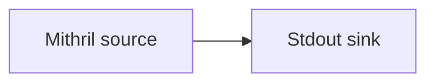

# Mithril bootstrap

Bootstrap a pipeline by downloading a [Mithril](https://mithril.network) snapshot, then
resume from a `Breadcrumbs` intersect. Useful for quickly syncing recent chain state without
replaying from origin.

## Pipeline



- **Source** — `Mithril`: downloads a verified snapshot from the configured `aggregator`
  into `./snapshot`, validating it against `genesis_key`
  (set `skip_validation = true` to skip verification).
- **Intersect** — `Breadcrumbs`: a list of recent points to resume from after the snapshot
  is restored.
- **Sink** — `Stdout`: prints each event.

> This example targets the Mithril **pre-release-preview** aggregator.

## Prerequisites

- Built with the `mithril` feature.

## Run

```sh
cd examples/mithril
oura daemon --config daemon.toml
```

From source:

```sh
cargo run --features mithril --bin oura -- daemon --config daemon.toml
```

The snapshot is downloaded to `./snapshot/` in the working directory.
