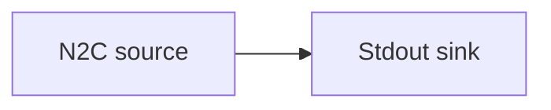

# Node-to-Client source

Read the chain directly from a local Cardano node over a Node-to-Client (N2C) Unix socket and
print events to standard output.

## Pipeline



- **Source** — `N2C`: connects to the node's `socket_path`, starting from the chain tip.
- **Sink** — `Stdout`: prints each event.

## Companion files

A `docker-compose.yml` is included to spin up a local node that exposes the socket.

```sh
docker compose up -d
```

## Run

> ⚠️ Unlike the other examples, `socket_path` in `daemon.toml` is written relative to the
> **repository root** (`examples/n2c_source/node/node.socket`). Run this example from the repo
> root, or edit the path to point at your node socket.

```sh
# from the repository root
oura daemon --config examples/n2c_source/daemon.toml
```
