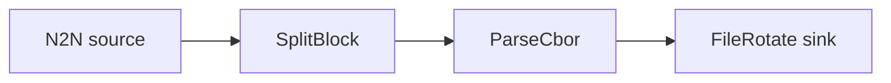

# Parse CBOR to JSONL files

Split blocks into transactions, decode their CBOR, and write the parsed records to rotated,
compressed JSONL files on disk.

## Pipeline



- **Source** — `N2N`: mainnet relay, starting from the `Point` in `[intersect]`.
- **Filters**
  - `SplitBlock`: breaks each block into individual transactions.
  - `ParseCbor`: decodes the raw transaction CBOR into structured records.
- **Sink** — `FileRotate`: writes JSONL to `./output/logs.jsonl`, rotating across up to 5
  compressed files of 5 MB each.

## Run

```sh
cd examples/parse_cbor
oura daemon --config daemon.toml
```

Output is written to `./output/` in the working directory.
