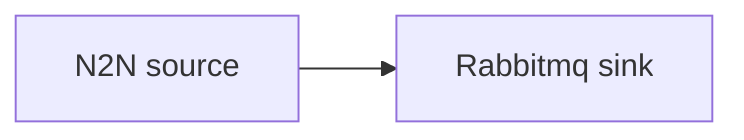

# RabbitMQ sink

Publish chain events to a RabbitMQ exchange over AMQP.

## Pipeline



- **Source** — `N2N`: mainnet relay, starting from the chain tip.
- **Sink** — `Rabbitmq`: publishes events to `exchange` on the broker at `url`.

## Prerequisites

- Built with the `rabbitmq` feature.
- A running RabbitMQ broker — a `docker-compose.yaml` is included.

```sh
docker compose up -d
```

## Run

```sh
cd examples/rabbitmq
cargo run --features rabbitmq --bin oura -- daemon --config daemon.toml
```

(or `oura daemon --config daemon.toml` with a binary built with the `rabbitmq` feature.)
