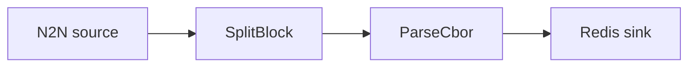

# Redis sink

Decode transactions and push them to a Redis stream.

## Pipeline



- **Source** — `N2N`: mainnet relay, starting from the chain tip.
- **Filters**
  - `SplitBlock`: breaks each block into individual transactions.
  - `ParseCbor`: decodes the raw transaction CBOR into structured records.
- **Sink** — `Redis`: appends events to `stream_name` on the Redis instance at `url`.

## Prerequisites

- Built with the `redis` feature.
- A running Redis instance — a `docker-compose.yaml` is included.

```sh
docker compose up -d
```

## Run

```sh
cd examples/redis
cargo run --features redis --bin oura -- daemon --config daemon.toml
```

(or `oura daemon --config daemon.toml` with a binary built with the `redis` feature.)
