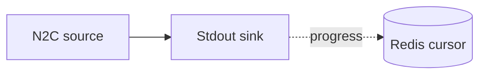

# Redis cursor

Persist pipeline progress to a Redis instance so that, on restart, Oura resumes from the last
processed point. Reads preprod over a Node-to-Client socket and prints events to standard
output.

## Pipeline



- **Source** — `N2C`: connects to the node socket at `./socket` (preprod), starting from
  `Origin` on the first run.
- **Cursor** — `Redis`: flushes the latest position to `key` on the instance at `url` every
  `flush_interval` seconds; subsequent runs resume from it.
- **Sink** — `Stdout`: prints each event.

## Prerequisites

- Built with the `redis` feature.
- A preprod node socket and a running Redis instance (see setup below).

## Setup

1. Provide a preprod node socket at `./socket`. Using the
   [Demeter CLI](https://docs.demeter.run/cli):

   ```sh
   dmtr ports tunnel
   ```

   Choose `node` → `preprod` → `stable`, and mount the socket on `./socket`.

2. Start Redis:

   ```sh
   docker compose up -d
   ```

## Run

```sh
cd examples/redis_cursor
cargo run --bin oura --features redis daemon --config daemon.toml
```

Inspect the stored cursor:

```sh
docker exec -it redis redis-cli
127.0.0.1:6379> GET key
```
