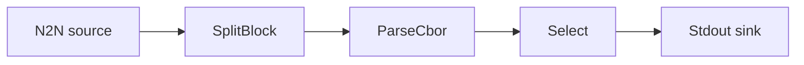

# Select by address

Keep only the transactions that touch a specific address and print them to standard output.

## Pipeline



- **Source** — `N2N`: mainnet relay, starting from the `Point` in `[intersect]`.
- **Filters**
  - `SplitBlock`: breaks each block into individual transactions.
  - `ParseCbor`: decodes the raw transaction CBOR into structured records.
  - `Select`: keeps only records matching the `predicate` address
    (`skip_uncertain = true` drops records it cannot confidently evaluate).
- **Sink** — `Stdout`: prints the matching transactions.

See the [Select filter docs](../../docs/v2/filters/select.mdx).

## Run

```sh
cd examples/select
oura daemon --config daemon.toml
```
