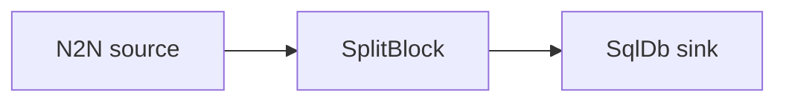

# SQLite sink

Split blocks into transactions and persist their raw CBOR into a local SQLite database using
templated SQL statements.

## Pipeline



- **Source** — `N2N`: mainnet relay, starting from the `Point` in `[intersect]`.
- **Filters** — `SplitBlock`: breaks each block into individual transactions.
- **Sink** — `SqlDb`: runs the `apply_template` / `undo_template` / `reset_template`
  statements against `sqlite:./mydatabase.db`, storing each transaction's slot and CBOR.
  Rollbacks and resets are handled by the undo/reset templates.

## Companion files

- `init.sql` — creates the `txs` table (and slot index) the templates write to.
- `Makefile` — `make create_db` runs `init.sql` against `mydatabase.db`.

```sh
make create_db          # or: sqlite3 mydatabase.db < init.sql
```

## Prerequisites

- Built with the `sql` feature.

## Run

```sh
cd examples/sqlite
cargo run --features sql --bin oura -- daemon --config daemon.toml
```

(or `oura daemon --config daemon.toml` with a binary built with the `sql` feature.)

The database is written to `./mydatabase.db` in the working directory.
