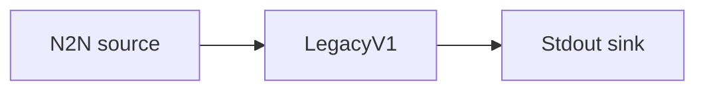

# Stdout

The simplest end-to-end pipeline: follow the mainnet chain from a fixed point and print
each event to standard output as legacy v1 JSON.

## Pipeline



- **Source** — `N2N`: connects to a mainnet relay over node-to-node, starting from the
  `Point` declared in `[intersect]`.
- **Filters** — `LegacyV1`: maps records to the legacy v1 event model
  (`include_transaction_details = true` expands transaction bodies).
- **Sink** — `Stdout`: prints one JSON event per line.

## Run

```sh
cd examples/stdout
oura daemon --config daemon.toml
```
