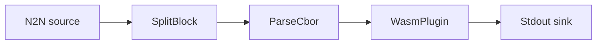

# WASM plugin filter

Run a custom WASM filter built in Go. The plugin under `./extract_fee` extracts the fee value
of each transaction, so the events printed to stdout are the per-transaction fees.

## Pipeline



- **Source** — `N2N`: mainnet relay, starting from the `Point` in `[intersect]`.
- **Filters**
  - `SplitBlock`: breaks each block into individual transactions.
  - `ParseCbor`: decodes the raw transaction CBOR into structured records.
  - `WasmPlugin`: loads `./extract_fee/plugin.wasm` and transforms each record (here,
    extracting the fee).
- **Sink** — `Stdout`: prints the plugin's output.

## Prerequisites

- Built with the `wasm` feature.
- [tinygo](https://tinygo.org/getting-started/install/) to compile the plugin.

> The core Go toolchain can target WebAssembly, but tinygo works well for plugin code. The Go
> code uses the [extism](https://github.com/extism) plugin system; see the
> [go-pdk docs](https://github.com/extism/go-pdk) for more.

## Setup

Build the plugin from inside `./extract_fee` — this produces the `plugin.wasm` that
`daemon.toml` already points at:

```sh
cd extract_fee
tinygo build -o plugin.wasm -target wasi main.go
```

## Run

```sh
cd examples/wasm_basic
cargo run --features wasm --bin oura -- daemon --config daemon.toml
```

(or `oura daemon --config daemon.toml` with a binary built with the `wasm` feature.)
