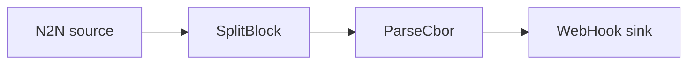

# Webhook sink

Post chain events to an HTTP endpoint using the `WebHook` sink.

## Pipeline



- **Source** — `N2N`: mainnet relay, starting from the `Point` in `[intersect]`.
- **Filters**
  - `SplitBlock`: breaks each block into individual transactions.
  - `ParseCbor`: decodes the raw transaction CBOR into structured records.
- **Sink** — `WebHook`: sends an HTTP request per event to the configured `url`
  (default `http://localhost:8080`).

See the [WebHook sink docs](../../docs/v2/sinks/webhook.mdx).

## Prerequisites

- An HTTP endpoint to receive the requests. Edit `url` in `daemon.toml` to point at it.

## Run

```sh
cd examples/webhook_basics
oura daemon --config daemon.toml
```
