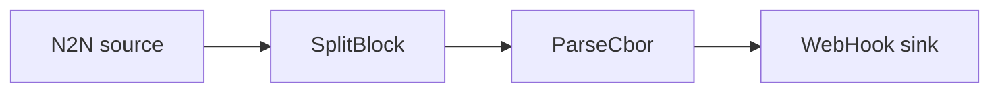

# Webhook sink

Post chain events to an HTTP endpoint using the `WebHook` sink.

## Pipeline



- **Source** — `N2N`: mainnet relay, starting from the `Point` in `[intersect]`.
- **Filters**
  - `SplitBlock`: breaks each block into individual transactions.
  - `ParseCbor`: decodes the raw transaction CBOR into structured records.
- **Sink** — `WebHook`: sends an HTTP request per event to the configured `url`
  (default `http://localhost:8080`).

See the [WebHook sink docs](../../docs/v2/sinks/webhook.mdx).

## Prerequisites

- An HTTP endpoint to receive the requests at the `url` in `daemon.toml`
  (default `http://localhost:8080`).

The included `docker-compose.yml` starts a small echo server on `:8080` that logs every
request it receives, so the example runs standalone:

```sh
docker compose up -d
```

To post to your own endpoint instead, skip the compose step and edit `url` in `daemon.toml`.

## Run

```sh
cd examples/webhook_basics
oura daemon --config daemon.toml
```

Watch the events arrive at the receiver:

```sh
docker compose logs -f webhook
```
