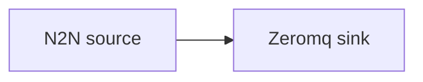

# ZeroMQ sink

Stream chain events out over a ZeroMQ PUSH socket.

## Pipeline



- **Source** — `N2N`: mainnet relay, starting from the chain tip.
- **Sink** — `Zeromq`: pushes events to the socket bound at `url`.

## Prerequisites

- Built with the `zeromq` feature.
- A ZeroMQ PULL consumer connected to the configured `url` to receive the messages.

## Run

```sh
cd examples/zeromq
cargo run --features zeromq --bin oura -- daemon --config daemon.toml
```

(or `oura daemon --config daemon.toml` with a binary built with the `zeromq` feature.)
